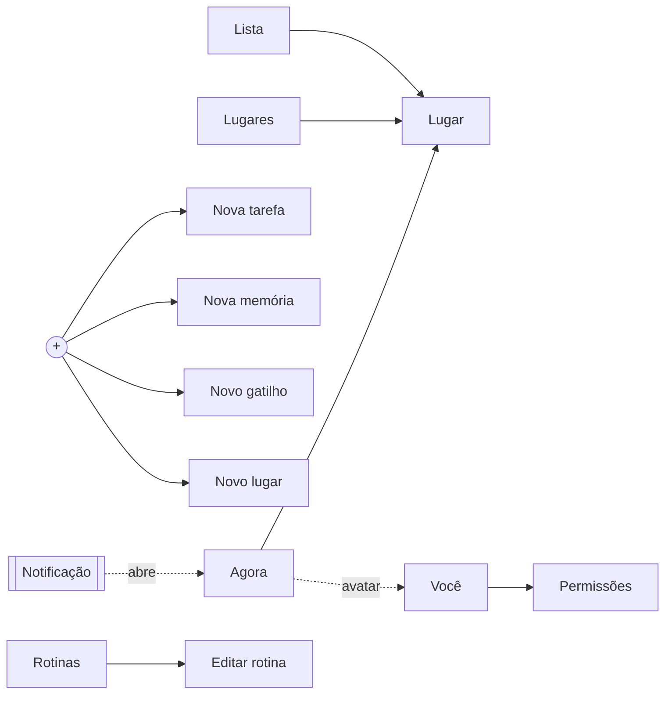
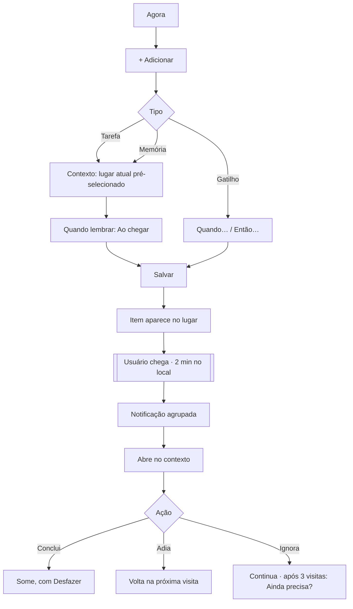
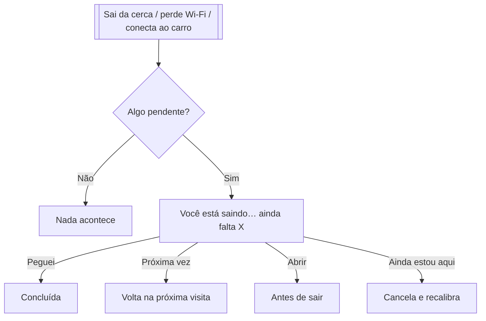

# Contexto — design de produto

> Eu não preciso lembrar. O aplicativo me lembra quando eu estiver no lugar certo.

Projeto de UX/UI completo de um app mobile (iOS e Android) que prende tarefas e memórias
ao **contexto** em que precisam ser lembradas: um lugar, o carro, uma rede Wi-Fi, uma tag NFC.
Sem IA: a detecção usa cercas virtuais do sistema, Wi-Fi, Bluetooth, NFC, QR Code e horário.

## Como abrir

Abra `design/index.html` (documentação) ou `design/prototipo.html` (demonstração clicável, com simulador de chegada/saída) no navegador. A documentação tem:

| Seção | Entregável |
|---|---|
| Conceito | Revisão de UX e melhorias propostas |
| Navegação | 1 · Arquitetura de navegação |
| Fluxos | 2, 9–13 · Fluxogramas (principal, tarefa, memória, gatilho, chegada, saída) |
| Lista de telas | 3 · 38 telas com objetivo, ação principal e o que foi removido |
| Telas | 4 e 5 · Wireframe e layout final (seletor no topo da página) |
| Estados | 6, 7 e 8 · Vazios, com dados, erro e permissão |
| Notificações | 14 · Regras, anatomia e textos |
| Design system | 15 · Cores, tipografia, espaçamento, botões, cartões, ícones, campos e estados |

As telas seguem o tema claro/escuro do sistema.

## Estrutura do código

```
design/
├── index.html        estrutura e textos da documentação
├── css/
│   ├── tokens.css    tokens (cores claro/escuro, tipo, espaço, raio, modo wireframe)
│   ├── app.css       componentes do aplicativo (.ph = tela de celular)
│   └── doc.css       layout da página de documentação
└── js/
    ├── icons.js      conjunto de 56 ícones (24 px, traço 1,75)
    ├── ui.js         componentes reutilizáveis: phone, tabBar, row, chip, btn,
    │                 field, opt, sheet, toast, banner, empty, place, map, notif…
    ├── screens.js    as 38 telas, montadas só com os componentes de ui.js
    ├── doc.js        fluxogramas, árvore de navegação, tabela e design system
    └── proto.js      protótipo interativo: estado, navegação, criação e simulador
```

Os nomes de componentes e tokens foram pensados para migrar direto para React Native,
Flutter ou SwiftUI/Compose (`--a-accent` → `colors.accent`, `row({kind:'mem'})` → `<ItemRow kind="memory" />`).

## Decisões principais

1. **Lugar = qualquer contexto.** Endereço, Bluetooth do carro, Wi-Fi, NFC ou QR. O usuário vê só "Carro".
2. **"Gatilho" não aparece na criação de tarefa.** Vira "Quando lembrar", com "Ao chegar" pré-selecionado.
3. **Adiar = próxima visita**, não "daqui a 1 hora".
4. **Sem avisos falsos.** Só avisa após 2 min no local (ou na hora, se Wi-Fi/NFC confirmar). Uma notificação por chegada.
5. **Saída combina sinais** (cerca, Wi-Fi, carro) e só avisa se há pendência. "Ainda estou aqui" corrige.
6. **O app admite incerteza.** Com sinal fraco: "Talvez você esteja em Supermercado?".
7. **Memória não é tarefa.** Sem prazo, sem caixa de marcar; pode ter "campo para anotar lá".
8. **Lugares por tipo** ("qualquer farmácia"), usando a categoria do mapa.
9. **Captura rápida** no +: escreve e vira memória do lugar atual em 2 toques.
10. **Privacidade no aparelho**, sem conta obrigatória.

## Navegação

`Agora · Lugares · [+] · Lista · Rotinas` — perfil ("Você") pelo avatar na tela Agora.



## Fluxo principal



## Saída de um lugar


